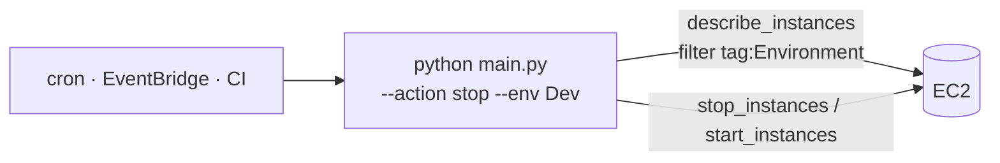

# AWS Environment Scheduler

[](https://github.com/emredogan-cloud/aws-environment-scheduler/actions/workflows/main.yaml)

Operational CLI that **starts or stops every EC2 instance in a given region that matches a tag filter** — useful for shutting down non-production environments outside business hours.

Designed to be invoked by a scheduler (cron, EventBridge → ECS task, GitHub Actions, Jenkins) on a daily cadence. The container exits as soon as the API request is dispatched; instance state transitions are observed out-of-band.




---

## What it does

- Connects to EC2 in the configured region (default `us-east-1`).
- Filters by `tag:Environment=<value>` (default `Dev`).
- Issues a single `stop` or `start` against the resulting collection.
- Exits — does **not** poll for terminal state.

```bash
python main.py --action stop  --env Dev --region us-east-1
python main.py --action start --env Dev --region us-east-1
```

| Flag | Default | Purpose |
|---|---|---|
| `--region` | `us-east-1` | Target AWS region |
| `--env` | `Dev` | Value for the `Environment` tag filter |
| `--action` | required | `start` \| `stop` |

---

## Repository Layout

```
aws-environment-scheduler/
├── main.py            # argparse CLI + EC2 resource interaction
├── requirements.txt   # boto3 only
├── Dockerfile         # python:3.12-slim, ENTRYPOINT=python main.py
├── docs/architecture.png
└── LICENSE
```

---

## Local Use

```bash
git clone https://github.com/emredogan-cloud/aws-environment-scheduler.git
cd aws-environment-scheduler
python -m venv venv && source venv/bin/activate
pip install -r requirements.txt

python main.py --action stop --env Dev --region eu-west-1
```

Credentials resolve through the standard boto3 chain.

---

## Docker

```bash
docker build -t aws-environment-scheduler:latest .

docker run --rm \
  -v ~/.aws:/root/.aws:ro \
  aws-environment-scheduler:latest \
  --action stop --env Dev
```

The image's `ENTRYPOINT` is `python main.py`, so additional flags appended to `docker run` are forwarded to the CLI.

---

## Required IAM

```json
{
  "Version": "2012-10-17",
  "Statement": [
    {
      "Effect": "Allow",
      "Action": ["ec2:DescribeInstances"],
      "Resource": "*"
    },
    {
      "Effect": "Allow",
      "Action": ["ec2:StartInstances", "ec2:StopInstances"],
      "Resource": "*",
      "Condition": {
        "StringEquals": { "ec2:ResourceTag/Environment": ["Dev"] }
      }
    }
  ]
}
```

The condition block is the safety net — without it, an accidental `--env Prod` invocation could touch production. Lock it down.

---

## Operational Notes

- **No state waiter.** The script issues the request and returns. Follow up with `aws ec2 describe-instances` if you need to confirm the transition.
- **No dry-run mode.** Use the AWS CLI's `--dry-run` against the same filter to validate scope before running.
- **No cross-region.** Run once per region with `--region`. Wrap in a loop or a CI matrix for multi-region environments.

---

## License

[MIT](LICENSE)
